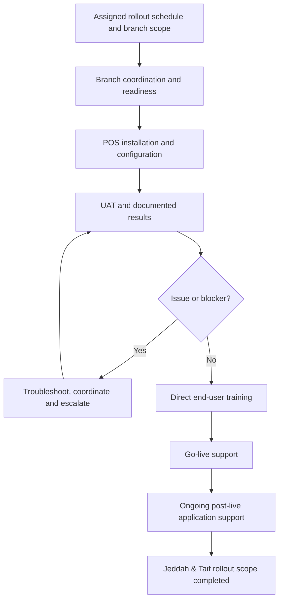

# Retail POS System Rollout & Implementation

**Professional Project | Enterprise Application Implementation**  
**Scope:** Jeddah & Taif retail branches  
**Role:** Application Support Specialist — POS Rollout Coordination & Implementation  
**Status:** Completed within my assigned Jeddah & Taif rollout scope

> A professional account of my work coordinating and executing a multi-branch retail Point of Sale (POS) application rollout. This repository documents my responsibilities and delivery approach, not the employer's source code, internal documents, or the enterprise-wide project in full.

## Project Overview

I supported the rollout of a retail POS application across branches in **Jeddah and Taif**. Working from an established rollout schedule, I coordinated implementation activities with relevant branch employees, internal IT stakeholders and the technology vendor. My work covered branch readiness, application installation and configuration, hands-on User Acceptance Testing (UAT), end-user training, go-live assistance and continued post-live application support.

The assigned Jeddah and Taif rollout scope was completed. Operational application support continued after deployment.

## My Role & Key Contributions

As an **Application Support Specialist**, I was responsible for coordinating and executing branch-level rollout activities. I **received and worked to the assigned implementation schedule**; I did not create the overall enterprise rollout schedule, control the project budget or lead the entire nationwide program.

- Coordinated branch-level deployment activities with branch employees, internal IT stakeholders and the technology vendor.
- Executed implementation activities according to the assigned rollout schedule and checked branch readiness before deployment.
- Installed and configured the POS application for branch use.
- Conducted UAT, documented test results and followed up on identified issues.
- Coordinated troubleshooting and vendor escalation when deployment or operational issues required additional support.
- Delivered direct training to branch employees.
- Provided go-live assistance and **ongoing post-live support** after installation and operational transition.
- Supported completion of the POS rollout within the assigned **Jeddah & Taif** geographic scope.

## Project Lifecycle

The following stages describe the work and handoffs within my assigned implementation scope, rather than asserting ownership of the company's full project-management lifecycle.

### 1. Project Context & Assigned Scope

The work involved deploying a retail POS application into operating branches. My implementation scope covered **Jeddah and Taif**, as part of a wider organizational initiative. I coordinated execution within this scope using the schedule provided to me.

### 2. Rollout Coordination & Branch Readiness

I coordinated deployment activities with the people involved at branch level and followed up on readiness ahead of the assigned implementation window. This included checking relevant technical and operational prerequisites and communicating issues requiring action before testing or live use.

**Coordination was a substantive part of my role:** preparing each branch for its scheduled activities, connecting branch users with the relevant technical teams, tracking deployment blockers and following up through implementation.

[See a generalized branch-readiness checklist →](docs/branch-readiness-checklist.md)

### 3. POS Installation & Configuration

I performed application installation and configuration activities within my assigned scope and checked that the POS environment was ready for validation. The proprietary software, deployment packages and internal settings are not reproduced here.

### 4. User Acceptance Testing (UAT)

I executed UAT scenarios, **documented the outcomes**, identified issues and followed up on resolution or escalation. The objective was to verify that relevant branch workflows could be performed before transitioning to live operation.

[Read the UAT overview →](docs/uat-overview.md)

### 5. Issue Follow-Up & Stakeholder Coordination

During implementation, I investigated issues within my support scope and coordinated with internal stakeholders and the technology vendor where escalation was needed. This work supported the connection between branch readiness, testing and operational launch.

### 6. End-User Training

I personally trained branch employees on using the new POS application, helping them adopt the workflows needed for daily retail operations.

### 7. Go-Live & Post-Live Support

My involvement continued **beyond installation**. I assisted branches during initial live operation and provided ongoing application support after deployment, including troubleshooting and escalation of incidents that affected daily use.

[Read about go-live and post-live support →](docs/go-live-and-post-live-support.md)

### 8. Scope Completion & Operational Continuity

The assigned rollout scope across **Jeddah and Taif branches was completed**. Completion here refers to rollout implementation in my assigned geographic scope—not the end of enterprise-wide deployment or ongoing application support.

[Full lifecycle notes →](docs/rollout-lifecycle.md)

## Delivery Highlights

| Area | Documented contribution |
|---|---|
| Implementation scope | Jeddah & Taif retail branches |
| Coordination | Branch-level implementation, stakeholder communication and issue follow-up |
| Deployment | POS application installation and configuration |
| Validation | Hands-on UAT and documented results |
| User enablement | Direct training for branch employees |
| Live operations | Go-live assistance and continued post-live application support |
| Outcome | Assigned Jeddah & Taif rollout scope completed |

No unsupported branch counts, financial benefits, performance percentages or project-budget claims are presented.

## Lessons Learned

The experience demonstrated why enterprise application delivery involves more than technical installation. A branch needs **coordinated readiness, validated business workflows, prepared users and ongoing support** to transition from deployment to practical use.

[Read the lessons learned →](docs/lessons-learned.md)

## Repository Contents

| File | Purpose |
|---|---|
| [Rollout lifecycle](docs/rollout-lifecycle.md) | Expanded narrative of the assigned implementation stages |
| [Branch readiness checklist](docs/branch-readiness-checklist.md) | Generalized, non-confidential portfolio template |
| [UAT overview](docs/uat-overview.md) | Public summary and illustrative test-case structure |
| [Go-live & post-live support](docs/go-live-and-post-live-support.md) | Continued operational support after deployment |
| [Lessons learned](docs/lessons-learned.md) | Reflections on delivery, coordination and support |

## Confidentiality & Attribution

This is an **individual professional portfolio summary of a real workplace initiative**, not an official employer publication. The POS application, company-wide program and vendor-managed components belong to the relevant organizations. This repository deliberately excludes internal system screenshots, configuration files, production data, credentials, branch identifiers, proprietary documentation and unverified business metrics. Illustrative checklists and test examples are clearly labeled; they are not presented as original company artifacts.
